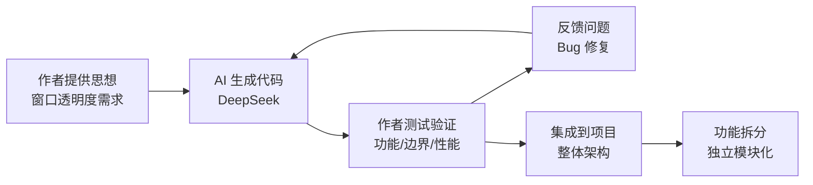

```markdown
# ImGuiTools - Dear ImGui 1.92.9 Docking Template

[](LICENSE)
[](https://github.com)
[](https://github.com/ocornut/imgui)
[](https://en.cppreference.com/w/cpp/20)
[](https://visualstudio.microsoft.com/)
[](https://deepseek.com)

一个基于 **Dear ImGui v1.92.9 WIP (Docking分支)** 的现代化 C++ 桌面应用开发模板。
### 视频演示地址：
https://www.bilibili.com/video/BV18j7Z6bERY/?share_source=copy_web&vd_source=8f734f1e86c1b345adc07138e11bb4e1
---

## 📋 目录

- [✨ 特性](#-特性)
- [🤝 贡献角色说明](#-贡献角色说明)
- [🌏 多语言支持 (UTF-8)](#-多语言支持-utf-8)
- [📦 版本详情](#-版本详情)
- [📁 项目结构](#-项目结构)
- [🚀 快速开始](#-快速开始)
- [💻 代码示例](#-代码示例)
- [🔧 编译配置](#-编译配置)
- [🎮 快捷键](#-快捷键)
- [📖 API 参考](#-api-参考)
- [❓ 常见问题](#-常见问题)
- [🤝 贡献指南](#-贡献指南)
- [📝 许可证](#-许可证)
- [🙏 致谢](#-致谢)
- [📋 更新日志](#-更新日志)

---

## ✨ 特性

| 特性 | 说明 |
|------|------|
| 🖼️ **ImGui 1.92.9 WIP** | 最新版本的 Dear ImGui |
| 🔗 **Docking 分支** | 完整的窗口停靠和拆分功能 |
| 🪟 **多视口支持** | 窗口可拖出主窗口成为独立系统窗口 |
| 🎨 **DirectX 11** | 高性能 GPU 渲染后端 |
| 🔍 **窗口透明度** | 内置透明度控制 (0.0-1.0) |
| 🌏 **多语言支持 (UTF-8)** | 全球所有语言开箱即用 |
| 🖱️ **完整输入** | 键盘、鼠标、游戏手柄 |
| 🛠️ **调试工具** | Metrics/Debugger、ID Stack Tool、Debug Log |
| 📝 **C++20 标准** | 使用最新的 C++ 标准 |
| 📄 **.slnx 格式** | VS2022+ XML 解决方案，更友好的 Git 合并 |

---

## 🤝 贡献角色说明

本项目的开发采用 **人类与 AI 协作** 的模式，各方的职责如下：

### 🤖 AI (DeepSeek) 职责
- 根据需求描述生成代码
- 遵循 Dear ImGui 源码架构和设计规范
- 提供符合项目风格的实现

### 👨‍💻 作者职责

| 职责 | 说明 |
|------|------|
| 💡 **提供思想** | 提出功能需求、设计思路和实现方向 |
| 🧪 **测试** | 验证代码正确性、边界条件和性能 |
| 📝 **反馈** | 发现问题、提出改进建议、迭代优化 |
| 🔧 **集成** | 将生成的代码整合到项目整体架构中 |
| 📂 **功能拆分** | 将复杂功能合理拆分为独立模块，保持代码清晰 |

### 📦 具体到本项目的透明度模块

`imgui_set_alpha.cpp` 和 `imgui_set_alpha.h` 的开发过程：



> 🤖 **AI 生成**：DeepSeek 根据 Dear ImGui 源码架构和作者的设计思路生成基础代码  
> 👨‍💻 **作者贡献**：提供需求思想、功能测试、问题反馈、项目集成、模块拆分

---

## 🌏 多语言支持 (UTF-8)

本项目已配置 **`/utf-8`** 编译选项，**完美支持全球所有语言的文本显示**。

### 支持的语言示例

```cpp
// 直接写任何语言的文本，无需任何转换
ImGui::Text("你好，世界！");              // 中文 (简体)
ImGui::Text("你好，世界！");              // 中文 (繁体)
ImGui::Text("こんにちは、世界！");        // 日文
ImGui::Text("안녕하세요, 월드!");          // 韩文
ImGui::Text("Здравствуй, мир!");         // 俄文
ImGui::Text("مرحبا بالعالم");             // 阿拉伯文
ImGui::Text("Bonjour le monde");         // 法文
ImGui::Text("Hallo Welt");               // 德文
ImGui::Text("Ciao mondo");               // 意大利文
ImGui::Text("Hello, 世界 🌍");            // 混合语言 + Emoji

// 按钮、标签、窗口标题同样支持
ImGui::Button("确认 ✓");
ImGui::Begin("设置 ⚙️ 窗口");
ImGui::MenuItem("文件 📁");
```

### UTF-8 技术原理

UTF-8 是 Unicode 的 8 位编码实现，具有以下特点：

| 特性 | 说明 |
|------|------|
| 🌐 **全球通用** | 单一编码支持 150+ 种书写系统 |
| 📝 **ASCII 兼容** | 0-127 范围与 ASCII 完全相同 |
| 🔗 **互联网标准** | HTML、JSON、XML、HTTP 默认编码 |
| 💾 **空间高效** | 英文 1 字节，中文 3 字节 |
| 🔄 **自同步** | 多字节字符可从任意位置开始解码 |
| 🛡️ **无字节序问题** | 无大小端(endianness)问题 |

> 💡 **提示**：在 Visual Studio 中保存源文件时，建议选择 **"UTF-8 with BOM"** 编码格式。

---

## 📦 版本详情

```
Dear ImGui:           1.92.9 WIP
IMGUI_VERSION_NUM:    19281
分支:                 Docking (完整多视口支持)
渲染后端:             DirectX 11
平台后端:             Win32
C++ 标准:             C++20
Visual Studio:        2022 (支持 .slnx)
字符编码:             UTF-8
```

### 1.92.9 重要特性

| 特性 | 说明 |
|------|------|
| **Font System Rework** | 全新的字体系统，支持动态字体大小 |
| **Multi-Select API** | 标准的多选/范围选择支持 |
| **Tables API 增强** | 表格功能改进，支持斜角表头 |
| **TextureRef 系统** | 更灵活的纹理管理 |
| **Viewport DPI Scaling** | 多显示器 DPI 自动适配 |
| **ImGuiBackendFlags_RendererHasTextures** | 动态纹理更新支持 |

---

## 📁 项目结构

```
ImGuiTools/
├── ImGuiTools.cpp              # 主程序入口
├── ImGuiTools.slnx             # Visual Studio 2022+ 解决方案 (XML 格式)
├── ImGuiTools.vcxproj          # 项目文件
├── ImGuiTools.vcxproj.filters  # 文件筛选器
└── include/
   └── imgui/                  # Dear ImGui 1.92.9 源文件
       ├── imgui.h             # 主头文件
       ├── imgui.cpp           # 核心实现
       ├── imgui_draw.cpp      # 绘制 API
       ├── imgui_tables.cpp    # 表格 API
       ├── imgui_widgets.cpp   # 控件 API
       ├── imgui_internal.h    # 内部 API (高级用户)
       ├── imgui_impl_win32.cpp/.h   # Win32 平台后端
       ├── imgui_impl_dx11.cpp/.h    # DirectX 11 渲染后端
       ├── imgui_set_alpha.cpp/.h    # 窗口透明度扩展
       ├── imconfig.h          # 编译时配置
       └── imstb_*.h           # STB 库
```

### 文件统计

| 类型 | 数量 | 总大小 |
|------|------|--------|
| 源文件 (.cpp) | 7 | ~2.5 MB |
| 头文件 (.h) | 9 | ~1.1 MB |
| 项目文件 | 4 | ~20 KB |
| **总计** | **20** | **~3.6 MB** |

---

## 🚀 快速开始

### 系统要求

| 组件 | 最低要求 | 推荐配置 |
|------|----------|----------|
| 操作系统 | Windows 10 (64-bit) | Windows 11 (64-bit) |
| Visual Studio | 2022 17.7+ | 2022 最新版 |
| DirectX | 11 | 11.1+ |
| GPU | DirectX 11 兼容 | DirectX 12 兼容 |
| 内存 | 4 GB | 8 GB+ |

### 步骤 1: 克隆仓库

```bash
git clone https://github.com/yourusername/ImGuiTools.git
cd ImGuiTools
```

### 步骤 2: 打开解决方案

**方法一（推荐）**：双击 `ImGuiTools.slnx`

**方法二**：VS2022 → 文件 → 打开 → 项目/解决方案 → 选择 `ImGuiTools.slnx`

> 💡 **关于 .slnx 格式**：这是 Visual Studio 2022+ 引入的 XML 格式解决方案文件，比传统 `.sln` 更适合版本控制，Git 合并更友好。

### 步骤 3: 编译运行

1. 解决方案配置选择 `Release`
2. 解决方案平台选择 `x64`
3. 按 `F5` 运行

---

## 💻 代码示例

### 基础窗口

```cpp
#include "imgui.h"
#include "imgui_impl_win32.h"
#include "imgui_impl_dx11.h"

// 在主循环中
ImGui::Begin("Hello, World!");
ImGui::Text("你好，世界！");  // UTF-8 多语言直接支持
if (ImGui::Button("确认 ✓")) {
    // 按钮点击处理
}
ImGui::End();
```

### 透明窗口

```cpp
#include "imgui_set_alpha.h"

// 设置透明度 (0.0 = 完全透明, 1.0 = 完全不透明)
ImGuiTransparentWindow::SetAlpha(0.85f);

// 使用透明窗口
ImGuiTransparentWindow::Begin("透明窗口", nullptr, ImGuiWindowFlags_NoCollapse);
ImGui::Text("这个窗口是半透明的");
ImGui::Text("透明度: %.1f%%", ImGuiTransparentWindow::GetAlpha() * 100);
ImGuiTransparentWindow::End();
```

### Docking 布局

```cpp
// 初始化时启用 Docking
ImGuiIO& io = ImGui::GetIO();
io.ConfigFlags |= ImGuiConfigFlags_DockingEnable;
io.ConfigFlags |= ImGuiConfigFlags_ViewportsEnable;

// 在 NewFrame() 之后创建 Dockspace
ImGui::DockSpaceOverViewport();
```

### 完整主循环

```cpp
// 主循环
while (running) {
    // 处理 Windows 消息
    MSG msg;
    while (PeekMessage(&msg, NULL, 0, 0, PM_REMOVE)) {
        TranslateMessage(&msg);
        DispatchMessage(&msg);
        if (msg.message == WM_QUIT) running = false;
    }
    
    // 开始 ImGui 帧
    ImGui_ImplDX11_NewFrame();
    ImGui_ImplWin32_NewFrame();
    ImGui::NewFrame();
    
    // Dockspace
    ImGui::DockSpaceOverViewport();
    
    // 你的 UI 代码
    ImGui::ShowDemoWindow();  // 官方 Demo
    
    // 透明窗口示例
    ImGuiTransparentWindow::Begin("我的应用");
    ImGui::Text("Hello, ImGui! 你好！");
    ImGuiTransparentWindow::End();
    
    // 渲染
    ImGui::Render();
    ImGui_ImplDX11_RenderDrawData(ImGui::GetDrawData());
    
    // 多视口更新
    if (io.ConfigFlags & ImGuiConfigFlags_ViewportsEnable) {
        ImGui::UpdatePlatformWindows();
        ImGui::RenderPlatformWindowsDefault();
    }
    
    // 交换缓冲区
    g_pSwapChain->Present(1, 0);
}
```

### 多语言界面示例

```cpp
// 国际化示例
const char* greeting = nullptr;
int language = 0;

ImGui::Combo("Language", &language, "English\0中文\0日本語\0한국어\0Русский\0");

switch (language) {
    case 0: greeting = "Hello, World!"; break;
    case 1: greeting = "你好，世界！"; break;
    case 2: greeting = "こんにちは、世界！"; break;
    case 3: greeting = "안녕하세요, 월드!"; break;
    case 4: greeting = "Здравствуй, мир!"; break;
}

ImGui::Text("%s", greeting);
```

---

## 🔧 编译配置

### imconfig.h 关键宏

```cpp
// Docking 和 Viewports (已在 docking 分支中默认启用)
#define IMGUI_HAS_DOCK
#define IMGUI_HAS_VIEWPORT

// Unicode 支持 - 支持扩展平面 (emoji、古文字等)
#define IMGUI_USE_WCHAR32

// 禁用一些功能以减小二进制大小 (可选)
// #define IMGUI_DISABLE_DEMO_WINDOWS
// #define IMGUI_DISABLE_DEBUG_TOOLS
```

### 项目编译选项 (Release|x64)

| 选项 | 设置 | 说明 |
|------|------|------|
| C++ 语言标准 | `stdcpp20` | C++20 标准 |
| UTF-8 支持 | `/utf-8` | 源代码 UTF-8 编码 |
| 字符集 | `Unicode` | Windows Unicode |
| 子系统 | `Windows` | Windows 应用程序 |
| 附加依赖库 | `d3d11.lib;d3dcompiler.lib;dxgi.lib` | DirectX 11 库 |

---

## 🎮 快捷键

| 快捷键 | 功能 |
|--------|------|
| `Ctrl+Tab` | 窗口切换器 |
| `Shift+Tab` | 反向窗口切换 |
| `Alt+拖拽` | 移动窗口 |
| `Ctrl+Wheel` | 字体缩放 |
| `Ctrl+Click` | 数值输入 (Slider/Drag) |
| `Ctrl+C` | 复制窗口内容 |
| `F10` / `Menu` | 打开上下文菜单 |
| `Escape` | 关闭当前弹窗/菜单 |

---

## 📖 API 参考

### ImGuiTransparentWindow 类

> 🤖 **AI 生成**：代码由 DeepSeek AI 根据 Dear ImGui 源码架构和作者的设计思路生成  
> 👨‍💻 **作者贡献**：提供思想、测试验证、问题反馈、项目集成、功能拆分

```cpp
class ImGuiTransparentWindow {
public:
    // 设置全局透明度 (0.0f = 完全透明, 1.0f = 完全不透明)
    static void SetAlpha(float alpha);
    
    // 获取当前透明度
    static float GetAlpha();
    
    // 开始一个透明窗口 (自动处理样式)
    static bool Begin(const char* title, bool* p_open = nullptr, 
                      ImGuiWindowFlags flags = 0);
    
    // 结束透明窗口
    static void End();
    
    // 更新所有视口的透明度
    static void UpdateAllViewports();
    
    // 设置所有视口为置顶窗口
    static void SetAllViewportsTopMost();
    
    // 手动更新特定视口
    static void UpdateViewport(ImGuiViewport* viewport);
    
    // 视口创建时调用
    static void OnViewportCreated(ImGuiViewport* viewport);
};
```

---

## ❓ 常见问题

### Q: 非英文字符显示为乱码？

**A**: 本项目已配置 `/utf-8` 编译选项。如果仍有问题：

1. 确保源文件保存为 **UTF-8 with BOM** 格式
2. VS2022: 文件 → 高级保存选项 → 选择 "Unicode (UTF-8 with signature)"
3. 检查字体是否支持目标语言

### Q: Emoji 不显示？

**A**: 确保：
1. 使用支持 Emoji 的字体 (如 Segoe UI Emoji、Noto Color Emoji)
2. 在 `imconfig.h` 中启用了 `#define IMGUI_USE_WCHAR32`

### Q: 无法打开 `.slnx` 文件？

**A**: `.slnx` 需要 **Visual Studio 2022 17.7 或更高版本**。

### Q: 窗口透明度不生效？

**A**: 
```cpp
// 确保在 Begin() 之前设置
ImGuiTransparentWindow::SetAlpha(0.8f);

// 如果使用多视口，需要更新
ImGuiTransparentWindow::UpdateAllViewports();
```

### Q: 透明度模块有问题如何反馈？

**A**: 欢迎通过 GitHub Issues 提交反馈，请提供：
- 复现步骤
- 环境信息 (OS、VS 版本)
- 预期行为和实际行为
- 相关代码片段

---

## 🤝 贡献指南

1. Fork 本仓库
2. 创建特性分支 (`git checkout -b feature/amazing`)
3. 提交修改 (`git commit -m 'Add something amazing'`)
4. 推送分支 (`git push origin feature/amazing`)
5. 创建 Pull Request

### 代码规范

- 遵循 ImGui 代码风格
- 使用 UTF-8 编码
- 添加必要的注释
- 确保编译无警告

---

## 📝 许可证

MIT License - 详见 [LICENSE](LICENSE) 文件。

---

## 🙏 致谢

- **[Dear ImGui](https://github.com/ocornut/imgui)** - 核心 GUI 库，Omar Cornut 及贡献者
- **Docking 分支** - 多视口和停靠功能
- **STB 库** - 字体渲染 (Sean Barrett)
- **DirectX** - 微软图形 API
- **[DeepSeek](https://deepseek.com)** - AI 辅助代码生成

---

---

## ⭐ Star History

如果这个项目对你有帮助，请给一个 Star ⭐

---

**Built with Dear ImGui v1.92.9 WIP | Docking Branch | DirectX 11 | C++20 | UTF-8**

---

## 📋 更新日志

### v1.0.0 (2026-06-04)

**初始版本发布** 🎉

- ✅ 基于 Dear ImGui v1.92.9 WIP
- ✅ 集成 Docking 分支，完整多视口支持
- ✅ DirectX 11 渲染后端
- ✅ Win32 平台后端
- ✅ 窗口透明度扩展 (AI 辅助生成)
- ✅ UTF-8 编码支持，全球语言开箱即用
- ✅ Visual Studio 2022 `.slnx` 格式
- ✅ 完整的调试工具集成
```
